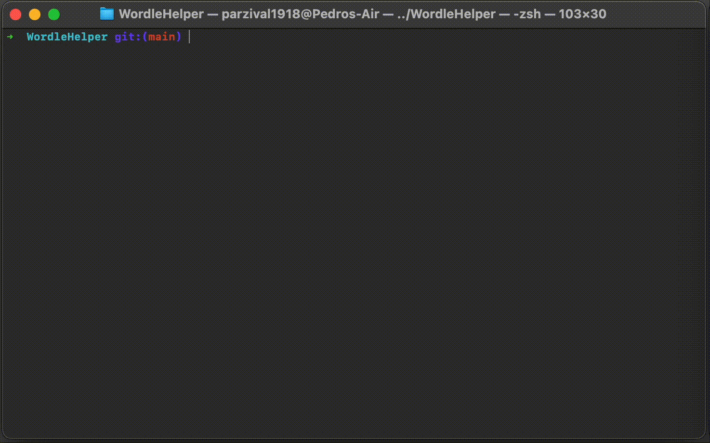

# WordleHelper

Input the correct letters and misplaced ones and program spits all words that comply with that.

## Installation

This was developed using Python 3.11.4.

1. Clone the repository using `git clone -n --depth=1 --filter=tree:0 https://github.com/Parzival1918/WordleHelper`
2. `cd WordleHelper` into the directory
3. `git sparse-checkout set --no-cone code`
4. `git checkout`. This will checkout only the code directory, with the program inside.
5. Test that the code works by doing `python3 code/wordle-helper.py -h`

To run the program use `python3 wordle-helper.py` in the code directory.

If you want to run the code from anywhere, you can add the code directory to your PATH variable and set it as an executable with the command `chmod +x wordle-helper.py`. First you will need to change the first line of the file to `#!/usr/bin/python3` or something else depending on your system, basically the **path to your python3 installation in your system**. After that you can run the program from anywhere in your system by typing `wordle-helper.py` in your terminal.

### Dependencies

* argparse
* json
* os

## wordle-helper.py Args

### *-h, --help* 

Show help message and exit

### *-i INPUT, --input INPUT*

**Required argument**

Input the word that you have tried in Wordle with the format:

* CAPITAL letter for correct letters in correct positions
* lowercase letter for a correct letter but incorrect position
* "_" for positions with the wrong letter

Example input: -i pLE__

* "p" is a correct letter but in the wrong position
* "L" and "E" are both correct and in their correct positions

### *-w WRONG, --wrong WRONG*

Input the letters to exclude from the results.

Example input: -w abc

### *-j, --json-output*

Output the result in json format

### *-s, -sorted*

Sort the possible words by their usage in the english language. Information taken from https://www.kaggle.com/datasets/rtatman/english-word-frequency

Word list taken from https://github.com/tabatkins/wordle-list.
